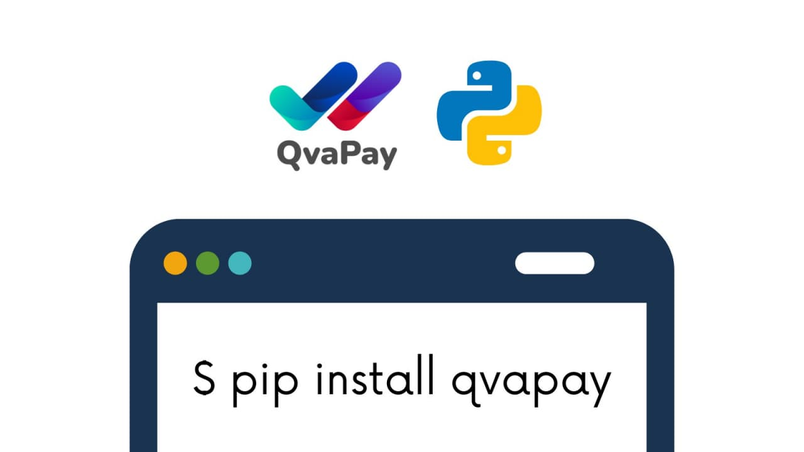

# Python SDK for the QvaPay API



Non official, but friendly QvaPay library for the Python language.

[](https://opensource.org/licenses/MIT)
[](https://github.com/lugodev/qvapay-python/actions?query=workflow%3ACI)
[](https://codecov.io/gh/lugodev/qvapay-python)
[](https://pypi.org/project/qvapay)
[](https://github.com/lugodev/qvapay-python/commits)
[](https://github.com/lugodev/qvapay-python/commits)
[](https://github.com/lugodev/qvapay-python/stargazers)
[](https://github.com/lugodev/qvapay-python/network/members)
[](https://github.com/lugodev/qvapay-python)
[](https://github.com/lugodev/qvapay-python/graphs/contributors)<!-- ALL-CONTRIBUTORS-BADGE:START - Do not remove or modify this section -->
[](#contributors-)<!-- ALL-CONTRIBUTORS-BADGE:END -->

## Setup

You can install this package by using the pip tool and installing:

```bash
pip install qvapay
```

Or:

```bash
easy_install qvapay
```

## Sign up on QvaPay

Create your account to process payments through QvaPay at [https://qvapay.com/register](https://qvapay.com/register).

## Using the client

First, import the Client class and create your QvaPay client using your app credentials.

```python
from qvapay import Client

client = Client(app_id, app_secret, version=1)
```

### Get your app info

```python
info = client.info()
```

### Get your account balance

```python
balance = client.balance()
```

### Create an invoice

```python
transaction = client.create_invoice(
    amount=10,
    description='Ebook',
    remote_id='EE-BOOk-123' # example remote invoice id
)
id = transaction.id
```

### Get transaction

```python
transaction = client.get_transaction(id)
```

### Get transactions

```python
transactions = client.transactions()
```

You can also read the QvaPay API documentation: [https://qvapay.com/docs](https://qvapay.com/docs).

## Contributors ✨

Thanks goes to these wonderful people ([emoji key](https://allcontributors.org/docs/en/emoji-key)):

<!-- ALL-CONTRIBUTORS-LIST:START - Do not remove or modify this section -->
<!-- prettier-ignore-start -->
<!-- markdownlint-disable -->
<table>
  <tr>
    <td align="center"><a href="https://lugodev.com"><br /><sub><b>Carlos Lugones</b></sub></a><br /><a href="https://github.com/lugodev/Qvapay Python/commits?author=lugodev" title="Code">💻</a></td>
    <td align="center"><a href="http://codeshard.github.io/"><br /><sub><b>Ozkar L. Garcell</b></sub></a><br /><a href="https://github.com/lugodev/Qvapay Python/commits?author=codeshard" title="Code">💻</a></td>
  </tr>
</table>
<!-- markdownlint-restore -->
<!-- prettier-ignore-end -->

<!-- ALL-CONTRIBUTORS-LIST:END -->

This project follows the [all-contributors](https://github.com/all-contributors/all-contributors) specification. Contributions of any kind welcome!

<p align="center">
    
</p>
